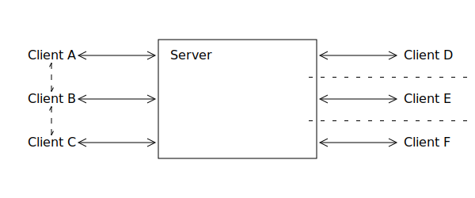
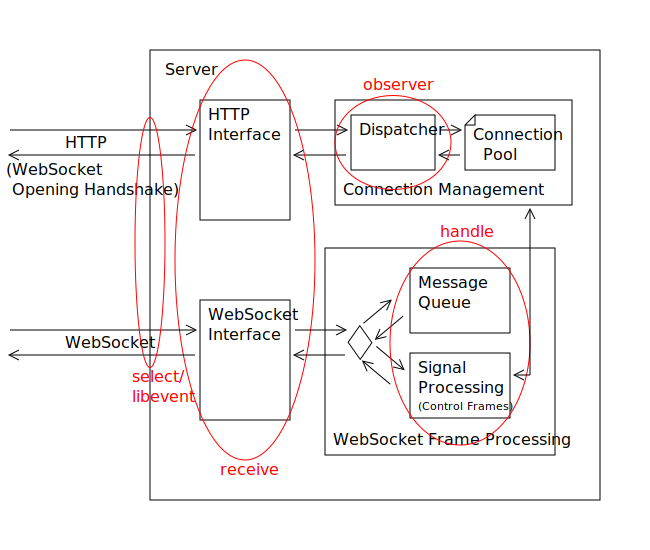

# WebSocket-Server

## Abstract

The WebSocket protocol allows browsers and other clients to communicate with
a server in a similar fashion like normal network sockets.
It operates on layer 7 of the OSI model.
For example it describes how the packages safely pass through proxys.
On the other hand the protocol describes own mechanisms of fragmentation.

The goal of this project is to create a WebSocket server that is controllable
from the command line or from server side scripts. The two main parts are
- the connection managment so that the user can easily
use it without exactly knowing how WebSockets work,
- and the scheduling and load balancing for proper
handling of multiple connections at once.



Use cases for such a server are for example web pages with a chat component or games.
Another use case would be push notifications inside a web site.
These are two different categories of clients.
- In one case they can communicate between each other.
- In the other they are completely unaware of each other.

## Introduction

A large portion of the modern web pages are dynamic.
To accomplish this JavaScript is used to update the page.
Sometimes whole pages display completely dynamic content.
Very often this updates to this content depend on external factors.
This updates have to get loaded from the server again.

To receive this update one way would be to simply reload the page.
A more hidden way is to reload the content in an invisible iframe or
just use an asynchron HTTP request. But this has a large overhead
as each request has easily twice the size of the actual update.
This is espacially the case if the new content should be displayed as fast
as possible and it is unpredictable for the client when to search for it.
For example this is the case in a chat application.
To minimise the overhead the request blocks and
the server only sends a response if new information are available.
This approach is called long polling.

WebSockets are a way to get rid of most of this overhead.
By just opening one connection and keeping it open only one request is needed.
Through this two way communication is possible triggered by any of server or client.
The WebSocket protocol is specified in [RFC 6455](https://tools.ietf.org/html/rfc6455).
In the OSI model it operates on the layers 5 through 7 as an application.
This classification is a litte bit odd as the protocol provides it own fragmentation mechanics.
For further information see [1.5. Design Philosophy](https://tools.ietf.org/html/rfc6455#section-1.5) in the referenced RFC.

The clients of a WebSocket connection are usually browsers.
As such web pages should be available in all larger browsers
the support for WebSockets is wide and embedded directly in the browser.
The interface how to use WebSockets from JavaScript is defined by the [w3c](https://www.w3.org/TR/websockets/).

On the other hand the wide spreaded HTTP servers do not provide
an implementation of WebSockets. To a certain extent that is reasonable
as two way communication is not the primary use case of a HTTP server.
The seperation of HTTP and WebSockets is easy as WebSockets usually use
a different port and the opening handshake looks like a HTTP request.
A server that does not support WebSockets can correctly answer such a request
with an apporpriate HTTP status code.

The goal of this practical course is to create an explicit WebSocket server.
This allows specific optimazation for this use case.
Nevertheless it is kept in mind that this project should be easily usable
along with classic HTTP servers like apache and nginx.
Therefore this program should provide an command line interface
which allows easy and full control from server side scripts.

## System overview


This is an overview over the program in server mode.
The following list describes the components in detail.
If they differ in functionality in client mode this is listed here as well.

- **HTTP Interface**: The opening handshake of a WebSocket connection actually
  looks like an HTTP request. (See [4. Opening Handshake](https://tools.ietf.org/html/rfc6455#section-4))
  This module is responsible for new connections. They get passed to the Dispatcher. 
  To support a client mode this also has to understand both halfs of the handshake.
- **Dispatcher**: This module is actually hard to see in the code.
  It is mostly hidden in the member functions of the Connection Pool and taks queues.
  The observer task described in the next section is also part of this module.
- **Connection Pool**: This is a container that lists the connections known by the server.
  It provides different member functions that allow various things.
  For example they can give access to messages received by the connection.
  Or they take messages and send them back over to the link. 
  When in client mode this container might get shrinked in comparison to server mode.
- **WebSocket Interface**: This module takes the WebSocket frames (See [5. Data Framing](https://tools.ietf.org/html/rfc6455#section-5))
  and extracts the payload from them. It stores the data in a section of the Connection Pool.
  This slightly varies in client mode.
- **Signal Processing**: This takes care of the correct response to control frames.
  (See [5.5. Control Frames](https://tools.ietf.org/html/rfc6455#section-5.5))
  It ensures that the connection is active as long as it exists.
  This module can also issue the closing of the conneciton to the Connection Pool.
- **Message Queue**: Here are the user messages enqueued. To allow useful
  reactions to them the user has to provide own functions. This module provides
  a frame for those functions. It calls them as new messages arrive.

### Client Mode

One extra feature of this program could be an extra client mode.
This would allow a connection to other servers which would be helpful for debugging.
Inside the application it should be easy to reverse who is server or client.
One difference is that less threads would be enough. But the code
executed by them differ only very little. This means most data structures
are left alone. The client can be seen as a server that only accepts one connection.

The largest differences in the protocol are the reversed opening handshake
and that packages from client to server have to get masked.
(See [5.3. Client-to-Server Masking](https://tools.ietf.org/html/rfc6455#section-5.3))
But with differences like this in mind during the development
this feature comes with no extra cost.

### Usage

When first started it initialises the daemon that is listening on the connections.
It reads the static configurtion from a configuration file or the command line.
Parameters that can be set this way are for example the port to listen on or the server name.

Further configuration can be done by recalling the program.
Parameters given this time get passed to the daemon.
With this it is possible to manage connection or broadcast messages.
It can also be called from server side scripts like PHP or perl.
This way the server should be very flexible.

Communication with the main daemon takes place through tempfiles.
They get parsed in a similar way to incoming messages of the clients.
This means if new commands should be added they get added like reations to client messages.

## Thread Structure

The folowing section describes the development process of the thread model.
Each subsection complies to one step in this procedure.

### First approach

The program consists of four different type of tasks.
If the program runs in client mode less threads are needed.
The following table lists the planned threads per task.

| Server mode | Client mode |
| ----------- | ----------- |
| 1× select   |             |
| 2× receive  | 1× receive  |
| 4× handle   | 1× handle   |
| 1× observer | 1× observer |



The communication between the threads happens through simple queues.

Select checks for incoming messages on the open connections.
This can be done using the system call select.
Another possibility would be the use of libevent.
All channels with incoming communication get written into a queue to be read by the receive threads.
For a client this task is not really needed. For simplicity it may stay nevertheless.

The receive task reads the data from the channel.
Before putting it into the next queue it also decodes the messages (See [5.3. Client-to-Server Masking](https://tools.ietf.org/html/rfc6455#section-5.3)).
As messages may be larger move sematics are used to prevent them to get copied over and over again.

Handle tasks take messages from the queue and process them.
How this happens is described in more detail in the next section.
The reaction to user messages is done through shared objects loaded at the runtime.
As there are more threads of this type, this task should be allowed to take longer to deal with the message.
But it should not block waiting for other messages. Otherwise deadlocks may occur.
Extra priority levels should still ensure quick handling of control frames.
For example a ping request should not take to long as the client otherwise assumes a broken connection.

The observer is a control thread that can read from stdin or tempfiles to trigger actions.
It should also be able to trigger ping request on its own if requested.
For examples what the observer should cause see the previous passage Usage.

If this program runs in client mode only one thread is actually needed.
But the tasks stay valid anyway, so for simplicity the structure is kept.
This also allows the response to control frames during a user message manipulation.


### Comparison to task based approach

After a conversation with the advisor of this practical course it became apparent
that the model described in the previous section is very similar to a task based approach.

One difference is that with plain tasks any thread can process any task.
This requires better scheduling so that the program does not hang during larger computations.
In the model above this could not happen but one is dependend on the scheduling of the operating system.

Another difference is that there is one queue per worker thread in the task based approach.
In the model above there is only one queue per step from task to task.
This is possible as there are not that many different types of tasks.
Also as this program is not designed for High Performance Computing
one queue for all threads is enough.

The task based approach which is compared against the model above can be found in this [thesis](http://www.mnm-team.org/~fuchst/master_thesis_tobias_fuchs.pdf#figure.caption.49).


### Final thread model

In the final program there is a mix of both approaches.
There are general worker threads that can dispatch any tasks.
But only _receive_ and _handle_ are processed as tasks.
Regaring this little number only one queue for all worker threads is used.
This is supject to change if it does not scale well
however this is over the scope of this practical course.
Internally the queue consists of multiple containers to allow differnt priorities.

Instead of plain _select_ the library libevent is used.
As this is directly feeded into the task queue the difference should nor be large.
But as an outlook it would be interesting to see how large the difference
between `select` and `libevent` really is.
In both cases it will run in a seperate thread.

The _observer_ will also just stay a seperate thread.
It will periodically check for jobs it has to do and will sleep otherwise.

Since the seperate threads just enque further tasks and are blocked otherwise
they only put very little load onto the system.
Therefore the should not get into the way of the worker threads.

## Package handling

Currently there are six different frame types defined in the WebSocket protocol.
- Two different user message types,
- Three different control frames and
- One that specifies that the frame is just a continuation of the previous one.

The first technique that comes to mind is pattern matching.
This would be easily possible in C++ using types and overloaded functions.
Unfortunatly the messages that are processed cannot be categorized
during the compile time. In the runtime when this categorization happens
the program has no idea about types. This means that this approach
is not that easy to realise.

It would be nice if this code snippet would work.
Exactly the above described problem arises.
```c++
void handle(GenericMessage & m) {
  handle(reinterpret_cast<typename MessageType<m.opcode>::type>(m));
}
```

Instead the code would have to look like this.
The code repeats itself very often.
Luckily it is only relevant for five or six differnt values in this case.
```c++
void handle(GenericMessage & m) {
  if(m.opcode == WS_CLOSE) {
    handle(reinterpret_cast<MessageType<WS_CLOSE>::type>(m));
  } else if(m.opcode == WS_PING) {
    handle(reinterpret_cast<MessageType<WS_PING>::type>(m));
  } else if(m.opcode == WS_PONG) {
    handle(reinterpret_cast<MessageType<WS_PONG>::type>(m));
  } else if(m.opcode == WS_TEXT) {
    handle(reinterpret_cast<MessageType<WS_TEXT>::type>(m));
  } else if(m.opcode == WS_BIN) {
    handle(reinterpret_cast<MessageType<WS_BIN>::type>(m));
  }
}
```

There are more ways to get to a result like this.
But they all require some kind of duplicated code like this.
This is a little bit startling as the complier can easily deal with such a case
if the parameters are known at the compiletime.

### Configfuration of package reaction

During the opening handshake of the WebSocket protocol the client and the server
agree on a subprotocol to use. This protocol is layered on top of WebSocket.
This can be used to determine which function to call while handling the messages.

These function can be loaded dynamically at runtime from shared objects.
This makes the server very flexible as it does not require relaunching or recompiling.
There is no limit to the functions from the shared object.
This means it can do calculations, store values and use files.
It should only avoid to block waiting on other messages from clients as this
may lead to a deadlock. In case of a deadlock the remaining parts of
the server keep running through priorities during scheduling.

In these shared objects there also may be functions to respond to messages
from the observer thread. This enables to also influence the server from
server side scripts. For example this way a client can only use long polling
and present the user a nearly identic experience to a native WebSocket client.

As an outlook instead of shared objects python scripts may be an alternative.
Such scripts are easier to create and are therefore also very interesting
for a flexible server.

## Outlook

Like many other projects this program is far from fully finished.
Throughout this documentation there were references what could still be done.
Mostly just little experiments with performance and practicality.

Additionally a more creative program name would be nice as websocket-server is pretty generic.
Together with that a build system that sets appropriate default locations
for configuration and PID files is still missing as well.

Overall this program was developed to create a simple to use WebSocket server.
It is unclear if this program will ever be used in a productive system.
But it was a nice learning experience nevertheless.

