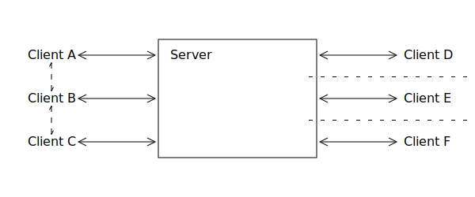

# WebSocket-Server

## Abstract

The WebSocket protocol allows browsers and other clients to communicate with
a server in a similar fashion like normal network sockets.
It operates on layer 7 of the OSI model.
For example it describes how the packages safely pass through proxys.
On the other hand the protocol describes own mechanisms of fragmentation.

The goal of this project is to create a WebSocket server that is controllable
from the command line or from server side scripts. The two main parts are
- the connection managment so that the user can easily
use it without exactly knowing how WebSockets work,
- and the scheduling and load balancing for proper
handling of multiple connections at once.

Use cases for such a server are for example web pages with a chat component or games.
Another use case would be push notifications inside a web site.
These are two different categories of clients.
- In one case they can communicate between each other.
- In the other they are completely unaware of each other.

