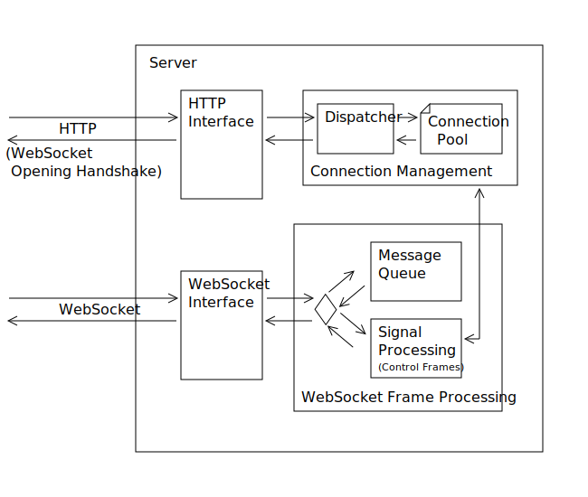

## System overview

This is an overview over the program in server mode.
The following list describes the components in detail.
If they differ in functionality in client mode this is listed here as well.

- **HTTP Interface**: The opening handshake of a WebSocket connection actually
  looks like an HTTP request. (See [4. Opening Handshake](https://tools.ietf.org/html/rfc6455#section-4))
  This module is responsible for new connections. They get passed to the Dispatcher. 
  To support a client mode this also has to understand both halfs of the handshake.
- **Dispatcher**: This module is actually hard to see in the code.
  It is mostly hidden in the member functions of the Connection Pool and taks queues.
  - todo observer task -
- **Connection Pool**: This is a container that lists the connections known by the server.
  It provides different member functions that allow various things.
  For example they can give access to messages received by the connection.
  Or they take messages and send them back over to the link. 
  When in client mode this container might get shrinked in comparison to server mode.
- **WebSocket Interface**: This module takes the WebSocket frames (See [5. Data Framing](https://tools.ietf.org/html/rfc6455#section-5))
  and extracts the payload from them. It stores the data in a section of the Connection Pool.
  This slightly varies in client mode.
- **Signal Processing**: This takes care of the correct response to control frames.
  (See [5.5. Control Frames](https://tools.ietf.org/html/rfc6455#section-5.5))
  It ensures that the connection is active as long as it exists.
  This module can also issue the closing of the conneciton to the Connection Pool.
- **Message Queue**: Here are the user messages enqueued. To allow useful
  reactions to them the user has to provide own functions. This module provides
  a frame for those functions. It calls them as new messages arrive.

### Client Mode

One extra feature of this program could be an extra client mode.
This would allow a connection to other servers which would be helpful for debugging.
Inside the application it should be easy to reverse who is server or client.
One difference is that less threads would be enough. But the code
executed by them differ only very little. This means most data structures
are left alone. The client can be seen as a server that only accepts one connection.

The largest differences in the protocol are the reversed opening handshake
and that packages from client to server have to get masked.
(See [5.3. Client-to-Server Masking](https://tools.ietf.org/html/rfc6455#section-5.3))
But with differences like this in mind during the development
this feature comes with no extra cost.

### Usage

When first started it initialises the daemon that is listening on the connections.
It reads the static configurtion from a configuration file or the command line.
Parameters that can be set this way are for example the port to listen on or the server name.

Further configuration can be done by recalling the program.
Parameters given this time get passed to the daemon.
With this it is possible to manage connection or broadcast messages.
It can also be called from server side scripts like PHP or perl.
This way the server should be very flexible.

- todo list of possible commands -

