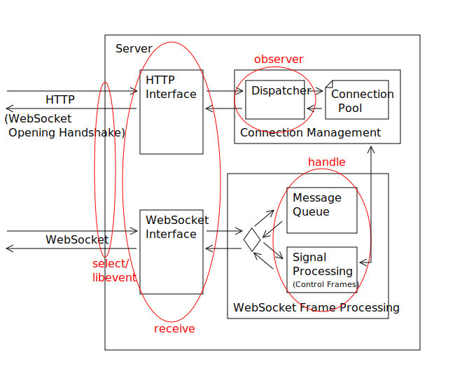

## Thread Structure

The folowing section describes the development process of the thread model.
Each subsection complies to one step in this procedure.

### First approach

The program consists of four different type of tasks.
If the program runs in client mode less threads are needed.
The following table lists the planned threads per task.

| Server mode | Client mode |
| ----------- | ----------- |
| 1× select   |             |
| 2× receive  | 1× receive  |
| 4× handle   | 1× handle   |
| 1× observer | 1× observer |

The communication between the threads happens through simple queues.

Select checks for incoming messages on the open connections.
This can be done using the system call select - todo ref mangpage.
Another possibility would be the use of libevent.
All channels with incoming communication get written into a queue to be read by the receive threads.
For a client this task is not really needed. For simplicity it may stay nevertheless.

The receive task reads the data from the channel.
Before putting it into the next queue it also decodes the messages (See [5.3. Client-to-Server Masking](https://tools.ietf.org/html/rfc6455#section-5.3)).
As messages may be larger move sematics are used to prevent them to get copied over and over again.
- todo fragmentation -

Handle tasks take messages from the queue and process them.
How this happens is described in more detail in the next section.
The reaction to user messages is done through shared objects loaded at the runtime.
As there are more threads of this type, this task should be allowed to take longer to deal with the message.
But it should not block waiting for other messages. Otherwise deadlocks may occur.
Extra priority levels should still ensure quick handling of control frames.
For example a ping request should not take to long as the client otherwise assumes a broken connection.

The observer is a control thread that can read from stdin or tempfiles to trigger actions.
It should also be able to trigger ping request on its own if requested.
For examples what the observer should cause see the previous passage Usage. - todo ref

If this program runs in client mode only one thread is actually needed.
But the tasks stay valid anyway, so for simplicity the structure is kept.
This also allows the response to control frames during a user message manipulation.

### Comparison to task based approach

After a conversation with the advisor of this practical course it became apparent
that the model described in the previous section is very similar to a task based approach.

One difference is that with plain tasks any thread can process any task.
This requires better scheduling so that the program does not hang during larger computations.
In the model above this could not happen but one is dependend on the scheduling of the operating system.

Another difference is that there is one queue per worker thread in the task based approach.
In the model above there is only one queue per step from task to task.
This is possible as there are not that many different types of tasks.
Also as this program is not designed for High Performance Computing
one queue for all threads is enough.

The task based approach which is compared against the model above can be found in this [thesis](http://www.mnm-team.org/~fuchst/master_thesis_tobias_fuchs.pdf#figure.caption.49).

### Final thread model

In the final program there is a mix of both approaches.
There are general worker threads that can dispatch any tasks.
But only _receive_ and _handle_ are processed as tasks.
Regaring this little number only one queue for all worker threads is used.
This is supject to change if it does not scale well
however this is over the scope of this practical course.

Instead of plain _select_ the library libevent is used.
As this is directly feeded into the task queue the difference should nor be large.
But as an outlook it would be interesting to see how large the difference
between `select` and `libevent` really is.
In both cases it will run in a seperate thread.

The _observer_ will also just stay a seperate thread.
It will periodically check for jobs it has to do and will sleep otherwise.

Since the seperate threads just enque further tasks and are blocked otherwise
they only put very little load onto the system.
Therefore the should not get into the way of the worker threads.

